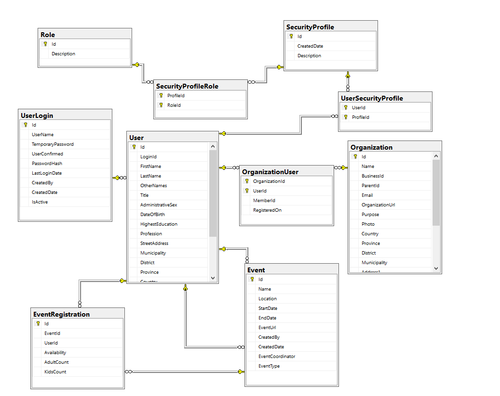

# UnitedNepali Database

The initial database schema description for the major domain entities are:  

## Login 
**UserLogin** table stores the user login information  
This table will be related to the **User** table to get the user related informations  

## User Management

**User** is the master table for the user personnel information  
**Roles** table holds the all available roles to access different functionality of the system  
**SecurityProfile** is the authorization previlege, that can be created by Administrator with specific roles  
**UserSecurityProfile** is the record of the users for their specific profiles  

## Organization Management

**Organization** is the master table for the organization level details  
**OrganizationUser** will keep track of the different users, association with particular organization  

## Events Management
**Event** is the master table for recording any events  
**EventRegistration** will keep track of the user coming in a particular event  

### Database Schema v1.0
The following snapshot shows the first version of the Schema:  

  

# Design Discussions
**Organization based Roles**
Roles are the application features to be controlled and currently, we provide same roles to all organization.
In future, if needed, we can enhance the feature by introducing **OrganizationRoles** table to limit each organization with specific roles.

**Organization based SecurityProfiles**
SecurityProfiles are the authorization given with certain roles for specific users. Currently, we have application level security profile. 
In futuer, if needed, we can enhance the feature by introducing **OrganizationSecurityProfile** table which will store the specific organization's profiles only,
and these is not shared with other organizations

# Database Information 

**Postgres** is the open source relational database. You can find more about this [here !!!](https://www.postgresql.org/)  
**pgAdmin4** is the database management tool, which might ease to design and view the tables/relations.  
